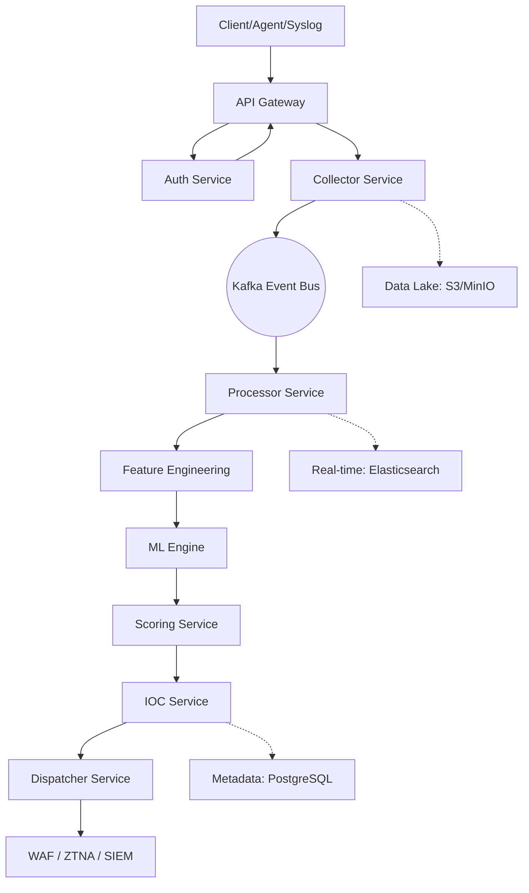
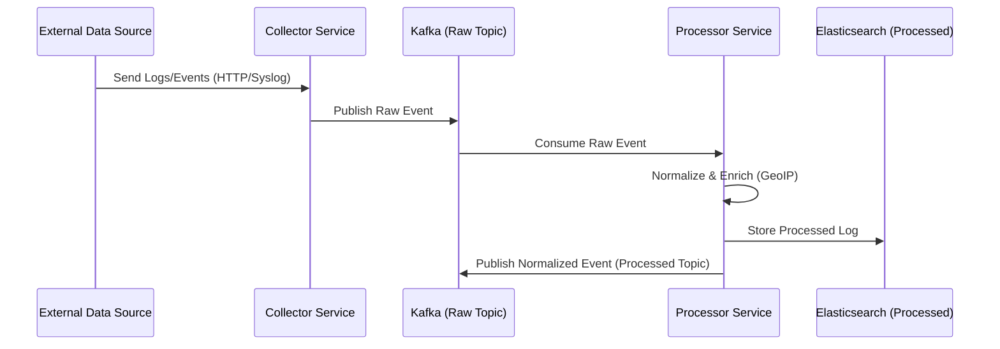
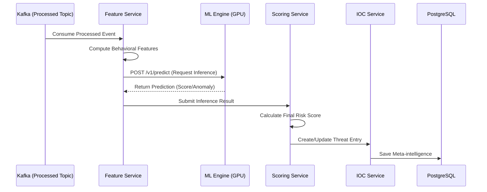
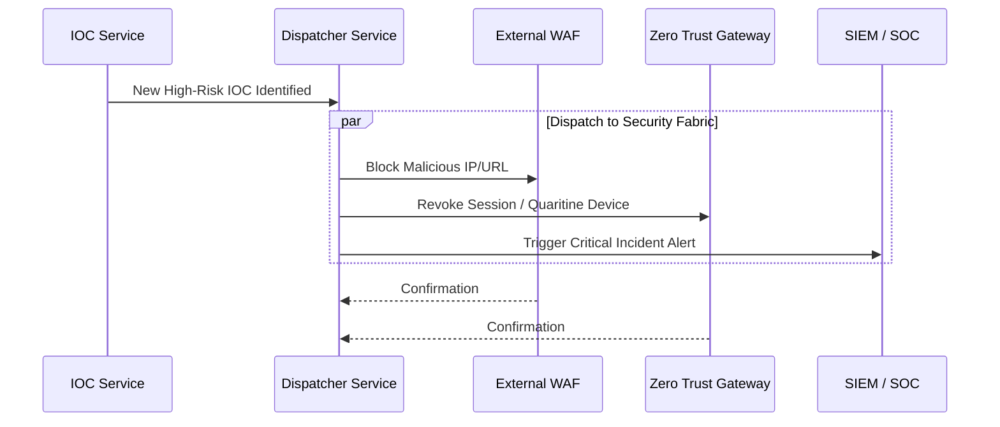
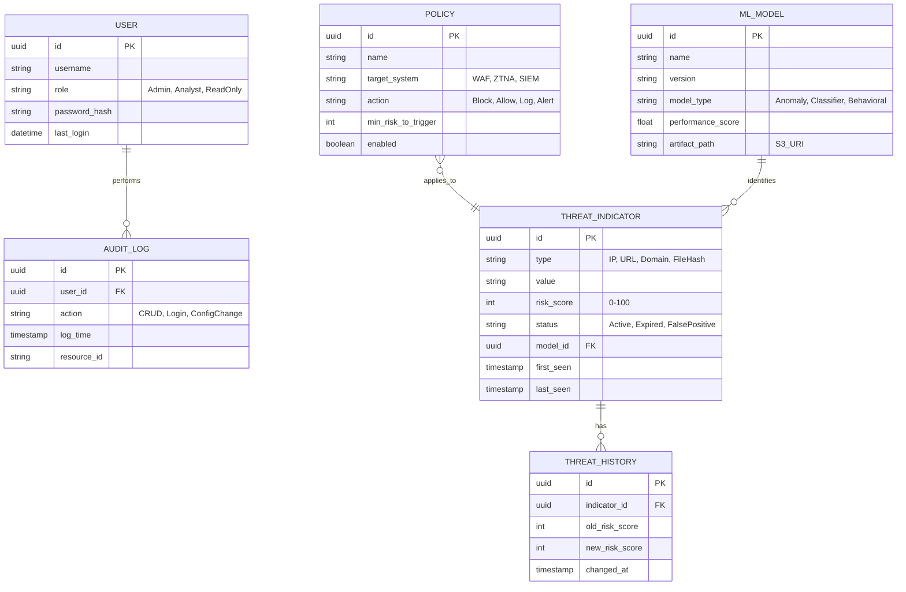

# Design Document: OmniNStack Threat Intelligence Engine (OTIE)

## 1. High-Level Architecture Overview

The **OTIE** is built on a distributed, event-driven microservices architecture. It leverages **Kafka** as the central internal event bus to ensure decoupled communication, high throughput, and fault tolerance.

### Architecture Diagram



## 2. Component Design

| Service | Responsibility | Core Technology |
| :--- | :--- | :--- |
| **Auth Service** | Identity & Access (JWT, SPIFFE) | Go, Postgres |
| **Collector** | Ingestion from multiple sources | Go, Kafka Producer |
| **Processor** | Normalization & Data Cleansing | Go, Kafka Consumer/Producer |
| **Feature Service** | Behavioral feature extraction | Go/Python |
| **ML Engine** | Deep Learning Inference | Python, FastAPI, PyTorch |
| **Scoring** | Risk Score Calculation | Go |
| **IOC Service** | Repository of threat indicators | Go, Elasticsearch |
| **Dispatcher** | Automated Policy Distribution | Go, Webhooks/gRPC |

---

## 3. Sequence Diagrams (Event Flows)

### 3-1. Ingestion & Normalization Flow



### 3-2. Threat Analysis & Scoring Flow



### 3-3. IOC Distribution & Automated Response Flow



---

## 4. Database Schema & ERD

The system uses **PostgreSQL** for relational metadata and **Elasticsearch** for high-volume logs/events. Below is the ERD for the PostgreSQL metadata layer.

### 4-1. PostgreSQL Entity Relationship Diagram



### 4-2. Data Storage Strategy

1. **Real-time Search (Elasticsearch)**: Used by Admin UI for log analysis and dashboard.
   - Indices: `otie-raw-events-*`, `otie-processed-events-*`.
2. **Cold Storage (S3/MinIO)**: Long-term archival for compliance and model re-training.
3. **Relational Meta-data (PostgreSQL)**: Internal system state and configuration.

---

## 5. Security & Connectivity

OTIE implements a **Zero Trust** architecture:

- **mTLS**: Every service requires mutual TLS for gRPC or HTTP communication.
- **Service Identity**: SPIFFE/SPIRE provides each pod with a verifiable SVID (Identity).
- **JWT**: Internal and External API access is controlled via short-lived JWT tokens.

---

## 6. Infrastructure & Deployment (Kubernetes)

### Helm Configuration Summary

- All deployments use **Resources Limits/Requests** for predictable performance.
- **HPA (Horizontal Pod Autoscaler)** scaling based on CPU/Memory and Kafka Lag metrics.
- **Priority Classes** used for critical services (ML Engine, Collector).

### GPU Support for ML Engine

```yaml
# Deployment Spec Fragment
resources:
  limits:
    nvidia.com/gpu: 1
```

> [!IMPORTANT]
> The ML Engine requires nodes with NVIDIA drivers and the NVIDIA Device Plugin installed for GPU acceleration.
