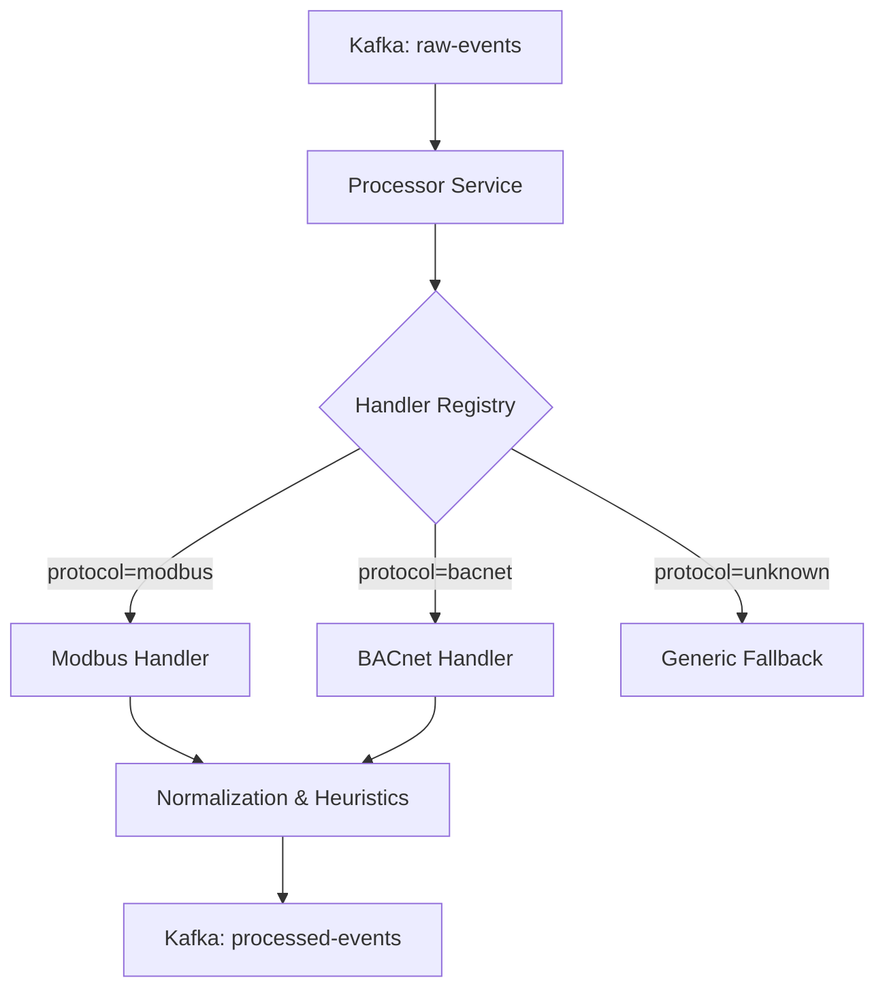

# OTIE Processor Architecture

The Processor Service is a high-performance normalization engine designed to convert diverse OT (Operational Technology) telemetry into a standardized format for machine learning and security analysis. It serves as a **Zero Trust Zero-Perimeter Policy Enforcement Point**, applying heuristic risk scoring at the point of ingestion.

## Design Philosophy

1.  **Protocol Agnostic Core**: The core service loop does not know about Modbus, BACnet, or Ethernet/IP. It delegates to specialized handlers.
2.  **Interface-Driven Extensibility**: New protocols are added by implementing the `ProtocolHandler` interface.
3.  **Heuristic Security**: Every event is assigned a `BaselineRiskScore` based on protocol-specific Zero Trust rules (e.g., function code allowlisting, value anomaly detection).
4.  **Idempotency**: Processing an event multiple times yields the same normalized output.

## Component Diagram

## Data Flow

1.  **Ingress**: The `Consumer` fetches a `LogEntry` (Protobuf/JSON) from the `raw-events` topic.
2.  **Dispatch**: The `ProcessorService` identifies the protocol and fetches the corresponding `ProtocolHandler`.
3.  **Normalization**:
    *   Unmarshals protocol-specific metadata (e.g., Modbus registers, BACnet properties).
    *   Applies Zero Trust heuristics to identify suspicious patterns.
    *   Calculates a `BaselineRiskScore` (0.0 to 1.0).
4.  **Egress**: The `ProcessedFeature` (Protobuf) is published to the `processed-events` topic.

## Zero Trust Heuristics

The processor implements several ZT patterns:
- **Function Code Filtering**: Only specific commands are permitted for certain device types.
- **Priority Monitoring**: In BACnet, life-safety priority overrides are flagged as critical.
- **Bounds Checking**: Values outside of configured sensor ranges trigger risk indicators.
